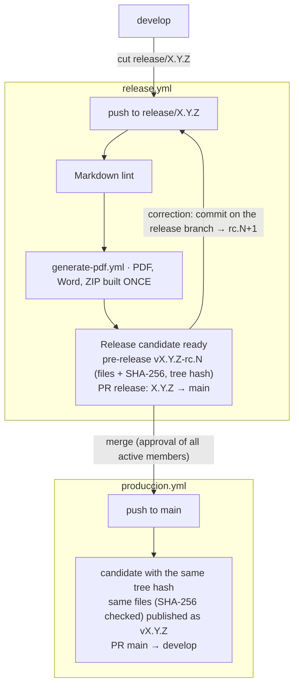

# Contributing Guide — Kntro-Soft / Report

Thank you for contributing to the **Reqs-AI** project report. This guide describes the workflow agreed upon by the team to keep the repository organized and the commit history clean.

## Table of Contents

- [Prerequisites](#prerequisites)
- [Branch Structure](#branch-structure)
- [Commit Convention](#commit-convention)
- [Workflow](#workflow)
- [Pull Requests](#pull-requests)
- [Releases](#releases)
- [Updating the CHANGELOG](#updating-the-changelog)

---

## Prerequisites

- Git installed and configured with your UPC name and email
- Access to the `Kntro-Soft/ReqsAI-Report` repository on GitHub
- A Markdown-compatible editor (VS Code, IntelliJ, etc.)

---

## Branch Structure

| Branch                   | Purpose                                                                                 |
|--------------------------|-----------------------------------------------------------------------------------------|
| `main`                   | Published deliverable. Only merged from `release/X.Y.Z` or `hotfix/X.Y.Z`.              |
| `develop`                | Integration branch. All features are merged here first.                                 |
| `feature/<issue>-<slug>` | New section, diagram, or new content.                                                   |
| `bugfix/<issue>-<slug>`  | Fix for typos, broken links, or incorrect data.                                         |
| `release/X.Y.Z`          | Deliverable X.Y.Z (TB1, TP1, TB2, TF...) cut from `develop`; candidates are built here. |
| `hotfix/X.Y.Z`           | Urgent fix of a published deliverable, cut from `main`.                                 |

Every branch starts from an issue on the [ReqsAI project board](https://github.com/orgs/Kntro-Soft/projects/3)
(status Backlog → Ready → In Progress → In Review → Testing → Done).

**Branch name examples:**
```
feature/76-context-mapping-acl-patterns
feature/77-c4-container-diagram
bugfix/78-broken-image-backlog
```

`main` and `develop` are protected by rulesets: pull request with 1 approval (stale approvals are dismissed),
the **Lint Markdown files** check must pass, no force-push or deletion, merge commits only. The link check
(*Verify image and markdown links*) still runs on every pull request but is not required, because external sites
can fail independently of the change.

---

## Commit Convention

We follow [Conventional Commits](https://www.conventionalcommits.org/en/v1.0.0/):

```
<type>(<scope>): <short description in lowercase>
```

| Type       | When to use                                                     |
|------------|-----------------------------------------------------------------|
| `feat`     | New section or new content added                                |
| `fix`      | Correction of errors in the report                              |
| `docs`     | Changes to README, CHANGELOG, or other repo documentation files |
| `refactor` | Reorganization of sections without content change               |
| `chore`    | Changes to assets, images, `.gitignore`                         |
| `style`    | Markdown formatting changes (spacing, tables, headings)         |

**Examples:**
```
feat(ch4): add context mapping ACL pattern toward Jira with detailed contract
fix(ch2): correct competitor names in comparison table
docs(changelog): record changes for version 2.1
chore(assets): replace C4 container diagram with updated version
```

---

## Workflow

```
1. Create a branch from develop
   git checkout develop
   git pull origin develop
   git checkout -b feature/76-my-section

2. Make changes to the report (README.md or assets/)

3. Commit following the convention
   git add .
   git commit -m "feat(ch4): description of the change"

4. Update CHANGELOG.md with the change made

5. Push and open a Pull Request targeting develop with "Closes #<issue>"
   git push origin feature/76-my-section
```

---

## Pull Requests

- Every PR must target `develop`, never directly `main`
- At least **1 approval** is required before merging
- The PR author fills out the `PULL_REQUEST_TEMPLATE.md` honestly
- Reviews must be completed within a maximum of **48 hours**
- Do not self-merge without another member's approval
- The PR description says `Closes #<issue>`, so merging closes the issue and links both on the board

Traceability: Issue → `feature/<issue>-<slug>` → commits → PR (`Closes #<issue>`) → `develop` → `release/X.Y.Z`
→ candidate `vX.Y.Z-rc.N` → `main` → release `vX.Y.Z`.

---

## Releases

Each deliverable (TB1, TP1, TB2, TF) is a release, following the organization flow (model C + tag at the end).
This repository deploys nothing, so there is no `staging` or `produccion` environment, approval or deploy
switch: the "artifact" is the set of PDF, Word and ZIP files, built once and published unchanged.



1. Cut `release/X.Y.Z` from `develop`; its first commit is `chore(release): X.Y.Z`, which sets `VERSION` to
   `X.Y.Z` and adds the `CHANGELOG.md` section.
2. Every push to the branch runs **Release** (`release.yml`): Markdown lint, the documents built once by
   `generate-pdf.yml`, the pre-release `vX.Y.Z-rc.N` with the three files, their SHA-256 and the git tree hash,
   and the pull request `release: X.Y.Z` to `main` (opened or updated by the workflow). Review the files attached
   to the pre-release; a correction is a new commit on the release branch and produces `rc.N+1`.
3. Merging the pull request into `main` (approval of all active team members) runs **Produccion**
   (`produccion.yml`): it finds the candidate whose tree hash equals the `main` commit (otherwise it fails: *main
   differs from the reviewed candidate*), checks the SHA-256 of its files, publishes those same files as the
   GitHub Release `vX.Y.Z`, and opens `chore: merge release X.Y.Z back into develop`.

`generate-pdf.yml` can also be run by hand (*Actions → Generate PDF from README → Run workflow*) to preview the
documents of any branch as workflow artifacts. CI (`Lint Markdown files`, link check) also runs on pushes to
`release/**` and `hotfix/**`, because the release pull request is opened by a workflow and starts no
`pull_request` run. The workflows need *Allow GitHub Actions to create and approve pull requests*; while it is
off, the run prints the link to open the pull request by hand.

---

## Updating the CHANGELOG

Every time report content is modified, update `CHANGELOG.md` at the root of the repository following the [Keep a Changelog](https://keepachangelog.com/en/1.1.0/) format:

```markdown
## [X.Y] - YYYY-MM-DD
### Added
- New section added

### Changed
- Description of what was modified

### Fixed
- Correction made
```
